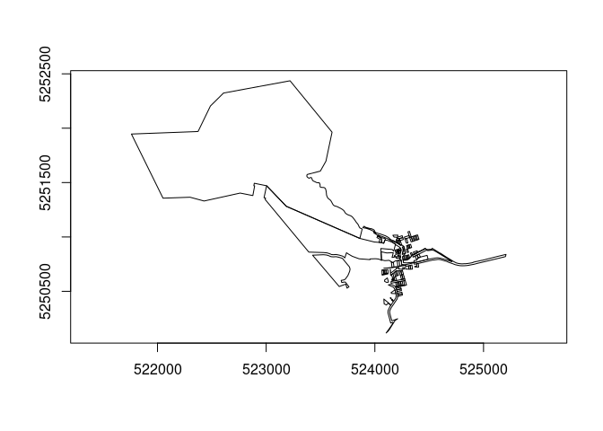

<!-- README.md is generated from README.Rmd. Please edit that file -->

# readwfs

<!-- badges: start -->

[](https://github.com/hypertidy/readwfs/actions/workflows/R-CMD-check.yaml)
<!-- badges: end -->

# readwfs

Read vector features from OGC Web Feature Services (WFS), OGC API
Features (OAPIF), and ArcGIS REST endpoints. Returns tibbles with
[wk](https://paleolimbot.github.io/wk/) geometry columns.

Built on [gdalraster](https://firelab.github.io/gdalraster/).

## Installation

``` r
# install.packages("pak")
pak::pak("mdsumner/readwfs")
```

## Quick start

``` r
library(readwfs)

# What services do we know about?
wfs_services()
#> # A tibble: 2 × 7
#>   name                   url               driver region description srs   notes
#>   <chr>                  <chr>             <chr>  <chr>  <chr>       <chr> <chr>
#> 1 LIST Tasmania          https://services… WFS    Tasma… Cadastral … EPSG… Rich…
#> 2 Esri SampleWorldCities https://samplese… WFS    Global Continents… EPSG… Alwa…

# Tasmania LIST open data WFS
url <- wfs_example_url("list_tasmania")

# What layers are there?
wfs_layers(url, version = "2.0.0", srs = "EPSG:28355")
#>  [1] "Public_OpenDataWFS:Climate_Futures_Tasmania_-_Scenario_A2"     
#>  [2] "Public_OpenDataWFS:Climate_Futures_Tasmania_-_Scenario_B1"     
#>  [3] "Public_OpenDataWFS:Interim_Planning_Scheme_-_Overlays"         
#>  [4] "Public_OpenDataWFS:Interim_Planning_Scheme_-_Zoning_Boundaries"
#>  [5] "Public_OpenDataWFS:Interim_Planning_Scheme_-__Zoning"          
#>  [6] "Public_OpenDataWFS:LIDAR_Climate_Futures_Index"                
#>  [7] "Public_OpenDataWFS:LiDAR_Coal_Mines_Port_Arthur_Index"         
#>  [8] "Public_OpenDataWFS:LiDAR_DPAC_Coastal_Index"                   
#>  [9] "Public_OpenDataWFS:LiDAR_Mt._Wellington_Index"                 
#> [10] "Public_OpenDataWFS:LIST_Address_Points"                        
#> [11] "Public_OpenDataWFS:LIST_Authority_Land"                        
#> [12] "Public_OpenDataWFS:LIST_Boundary_Segments"                     
#> [13] "Public_OpenDataWFS:LIST_Building_Points"                       
#> [14] "Public_OpenDataWFS:LIST_Building_Polygons_2D"                  
#> [15] "Public_OpenDataWFS:LIST_Cadastral_Parcels"                     
#> [16] "Public_OpenDataWFS:LIST_Coastline__MHWM_"                      
#> [17] "Public_OpenDataWFS:LIST_Contours_10m"                          
#> [18] "Public_OpenDataWFS:LIST_Contours_5m"                           
#> [19] "Public_OpenDataWFS:LIST_Crown_Leases"                          
#> [20] "Public_OpenDataWFS:LIST_Crown_Licences"                        
#> [21] "Public_OpenDataWFS:LIST_Easements__not_a_maintained_dataset_"  
#> [22] "Public_OpenDataWFS:LIST_Electoral_Divisions"                   
#> [23] "Public_OpenDataWFS:LIST_Hydrographic_Areas"                    
#> [24] "Public_OpenDataWFS:LIST_Hydrographic_Lines"                    
#> [25] "Public_OpenDataWFS:LIST_Hydrographic_Points"                   
#> [26] "Public_OpenDataWFS:LIST_Land_Districts"                        
#> [27] "Public_OpenDataWFS:LIST_Land_Tenure"                           
#> [28] "Public_OpenDataWFS:LIST_Legislative_Council_Divisions"         
#> [29] "Public_OpenDataWFS:LIST_Local_Government_Areas"                
#> [30] "Public_OpenDataWFS:LIST_Local_Government_Reserves"             
#> [31] "Public_OpenDataWFS:LIST_Locality_and_Postcode_Areas"           
#> [32] "Public_OpenDataWFS:LIST_Marine_Leases"                         
#> [33] "Public_OpenDataWFS:LIST_Marine_Nature_Reserves"                
#> [34] "Public_OpenDataWFS:LIST_Named_Feature_Extents"                 
#> [35] "Public_OpenDataWFS:LIST_Nomenclature"                          
#> [36] "Public_OpenDataWFS:LIST_Parish_and_Town_Boundaries"            
#> [37] "Public_OpenDataWFS:LIST_Points_of_Interest"                    
#> [38] "Public_OpenDataWFS:LIST_Private_Reserves"                      
#> [39] "Public_OpenDataWFS:LIST_Public_Land_Classification"            
#> [40] "Public_OpenDataWFS:LIST_Ramsar_Wetlands"                       
#> [41] "Public_OpenDataWFS:LIST_Survey_Control"                        
#> [42] "Public_OpenDataWFS:LIST_Transport_Nodes"                       
#> [43] "Public_OpenDataWFS:LIST_Transport_Segments"                    
#> [44] "Public_OpenDataWFS:LIST_Water_Districts"                       
#> [45] "Public_OpenDataWFS:LIST_Water_Management_Areas"                
#> [46] "Public_OpenDataWFS:Land_Tasmania_Aerial_Photography_Centres"   
#> [47] "Public_OpenDataWFS:Land_Tasmania_Aerial_Photography_Coverages" 
#> [48] "Public_OpenDataWFS:TASMAP_1_to_100000_Map_Index"               
#> [49] "Public_OpenDataWFS:TASMAP_1_to_25000_Map_Index"                
#> [50] "Public_OpenDataWFS:TASMAP_1_to_250000_Map_Index"               
#> [51] "Public_OpenDataWFS:TASMAP_1_to_5000_Orthophoto_Index"          
#> [52] "Public_OpenDataWFS:TASMAP_1_to_50000_Map_Index"                
#> [53] "Public_OpenDataWFS:TASMAP_Towns_Street_Atlas_Page_Index__v8_"  
#> [54] "Public_OpenDataWFS:LIST_Water_Management_Plan_Areas"           
#> [55] "Public_OpenDataWFS:TASVEG_3.0"                                 
#> [56] "Public_OpenDataWFS:TASVEG_4.0"

# Find specific layers
wfs_find_layers(url, "CADASTRAL|TASVEG")
#> [1] "Public_OpenDataWFS:LIST_Cadastral_Parcels"
#> [2] "Public_OpenDataWFS:TASVEG_3.0"            
#> [3] "Public_OpenDataWFS:TASVEG_4.0"

# Inspect before downloading
wfs_fields(url, "Public_OpenDataWFS:LIST_CADASTRAL_PARCELS",
           version = "2.0.0", srs = "EPSG:28355")
#> # A tibble: 16 × 7
#>    name       type       subtype   width precision is_nullable is_unique
#>    <chr>      <chr>      <chr>     <int>     <int> <lgl>       <lgl>    
#>  1 gml_id     OFTString  OFSTNone      0         0 FALSE       FALSE    
#>  2 OBJECTID   OFTInteger OFSTNone      0         0 TRUE        FALSE    
#>  3 CID        OFTInteger OFSTNone      0         0 TRUE        FALSE    
#>  4 VOLUME     OFTString  OFSTNone      8         0 TRUE        FALSE    
#>  5 FOLIO      OFTInteger OFSTInt16     0         0 TRUE        FALSE    
#>  6 PID        OFTInteger OFSTNone      0         0 TRUE        FALSE    
#>  7 POT_PID    OFTInteger OFSTNone      0         0 TRUE        FALSE    
#>  8 LPI        OFTString  OFSTNone      7         0 TRUE        FALSE    
#>  9 CAD_TYPE1  OFTString  OFSTNone     60         0 TRUE        FALSE    
#> 10 CAD_TYPE2  OFTString  OFSTNone     60         0 TRUE        FALSE    
#> 11 TENURE_TY  OFTString  OFSTNone     60         0 TRUE        FALSE    
#> 12 FEAT_NAME  OFTString  OFSTNone     60         0 TRUE        FALSE    
#> 13 STRATA_LEV OFTString  OFSTNone     60         0 TRUE        FALSE    
#> 14 COMP_AREA  OFTReal    OFSTNone      0         0 TRUE        FALSE    
#> 15 MEAS_AREA  OFTReal    OFSTNone      0         0 TRUE        FALSE    
#> 16 UFI        OFTString  OFSTNone     12         0 TRUE        FALSE

# Read features
parcels <- wfs_read(
  url,
  layer = "Public_OpenDataWFS:LIST_CADASTRAL_PARCELS",
  bbox = wfs_example_bbox("sandy_bay"),
  srs = "EPSG:28355", max_features = 1400
)
#> Reading 'Public_OpenDataWFS:LIST_CADASTRAL_PARCELS': 464 features available, geometry column 'SHAPE'
#>   498 features returned


parcels
#> # A tibble: 498 × 18
#>        FID gml_id  OBJECTID     CID VOLUME FOLIO     PID POT_PID LPI   CAD_TYPE1
#>    <int64> <chr>      <int>   <int> <chr>  <int>   <int>   <int> <chr> <chr>    
#>  1    2688 LIST_C…     2688 1104474 59944      4 5677504       0 GRF64 Private …
#>  2    2877 LIST_C…     2877 1023836 128641     1 1816976       0 FMR21 Private …
#>  3    3425 LIST_C…     3425 1145853 126957     1 3273346       0 FJA84 Authorit…
#>  4    4682 LIST_C…     4682 1023837 128641     2 1816984       0 FMR21 Private …
#>  5    6102 LIST_C…     6102 1249716 252507     1 7570663       0 FAC83 Private …
#>  6    6287 LIST_C…     6287 1023828 127656     3 1789939       0 FBF18 Private …
#>  7    6395 LIST_C…     6395 1502061 173638     1 9165211       0 GAV70 Private …
#>  8    8685 LIST_C…     8685 1407763 231575     1       0       0 <NA>  Casement 
#>  9   10819 LIST_C…    10819 1334013 152956     1 2818818       0 GDH05 Private …
#> 10   11600 LIST_C…    11600 1091759 58505      2 5677731       0 HSF79 Private …
#> # ℹ 488 more rows
#> # ℹ 8 more variables: CAD_TYPE2 <chr>, TENURE_TY <chr>, FEAT_NAME <chr>,
#> #   STRATA_LEV <chr>, COMP_AREA <dbl>, MEAS_AREA <dbl>, UFI <chr>,
#> #   geometry <wk_wkb>
wk::wk_plot(parcels$geometry)
```



## Service type auto-detection

readwfs detects the service type from the URL pattern:

| URL pattern | GDAL driver | Example |
|----|----|----|
| `WFSServer`, `service=WFS` | WFS | Tasmania LIST, Esri SampleWorldCities |
| `arcgis/rest/…/MapServer`, `FeatureServer` | ESRIJSON | ArcGIS REST services |
| `/collections`, `ogc/features` | OAPIF | OGC API Features |

Or set `driver` explicitly: `wfs_read(url, layer, driver = "ESRIJSON")`.

## Exported functions

| Function             | Purpose                               |
|----------------------|---------------------------------------|
| `wfs_services()`     | Catalogue of known public endpoints   |
| `wfs_layers()`       | List all layers on a service          |
| `wfs_find_layers()`  | Search layers by regex pattern        |
| `wfs_layer_info()`   | Geometry type, extent, feature count  |
| `wfs_fields()`       | Attribute schema for a layer          |
| `wfs_read()`         | Fetch features → tibble + wk geometry |
| `wfs_example_url()`  | Pre-configured example URLs           |
| `wfs_example_bbox()` | Pre-configured bounding boxes         |

## Design

- **gdalraster** for all I/O — no sf or terra required
- **wk** vectors for geometry interchange
- **tibble** for tabular output (unclassed, no sticky geometry)
- **geos** for spatial operations (suggested, not required)

## Contributing example services

If you find a good public WFS / OAPIF / ArcGIS REST endpoint, open an
issue. Good candidates are: no authentication required, reasonably fast,
interesting data, and ideally from a different part of the world than
existing examples.

## Code of Conduct

Please note that the readwfs project is released with a [Contributor
Code of
Conduct](https://contributor-covenant.org/version/2/1/CODE_OF_CONDUCT.html).
By contributing to this project, you agree to abide by its terms.
